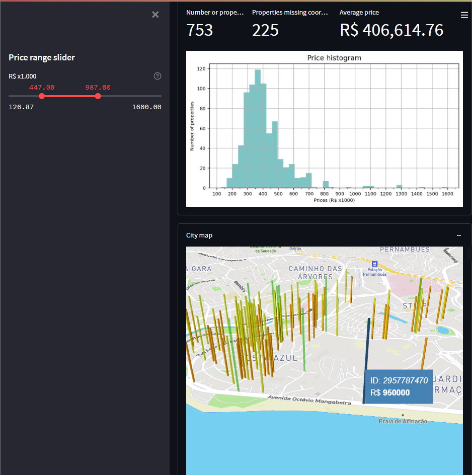

# properties-dashboard
My Streamlit app for properties pricing data visualization

## Intro

Streamlit is a great tool to develop data visualization. It's written in Python which is also a language widely used in data analysis and engineering.
What you'll see here is my take on a way to to quickly find properties by their prices in a city.
The prices were obtained by means of *scraping a certain website*, in the beginning of October 21'. To get them in an automated manner, a spider was built with the Python Scrapy module and it generated a .csv file, after submitting the scraped data through a few pipelines.

## Usage

To enjoy the dashboard, you must load the .csv file (there's a button on the dashboard for that purpose).
After loading the data, if the visualization is still cluttered, make use of the slider bar found on the left menu. It will filter the pricings according to the [minimum-maximum] range found.
The main visual feature idea was to map properties by columns which are proportional to their prices.
A color code to help locating prices according to price ranges was created (the prices grow according to the frequency of the color, inspired by the rainbow color sequence). That code also helps differentiating properties when they are located too close to each other. Another measure to help visualization was to give the more expensive a properties columns more transparency (but that's still not the ideal)
Hovering the mouse over a property will give away it's ID and it's price.

## Look

## Future features
There's also a few metrics like average price, number of properties found, and number of properties who did not get mapped because they lack coordinate information.
As of October 21' no history of pricing is being kept as I'm still working on my SQL studies. I also plan on improving how the overlapping price columns behave in order to give a better viewing experience.
